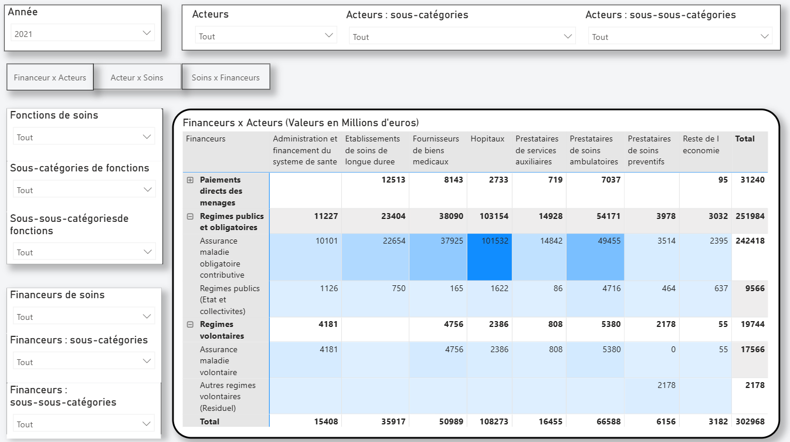
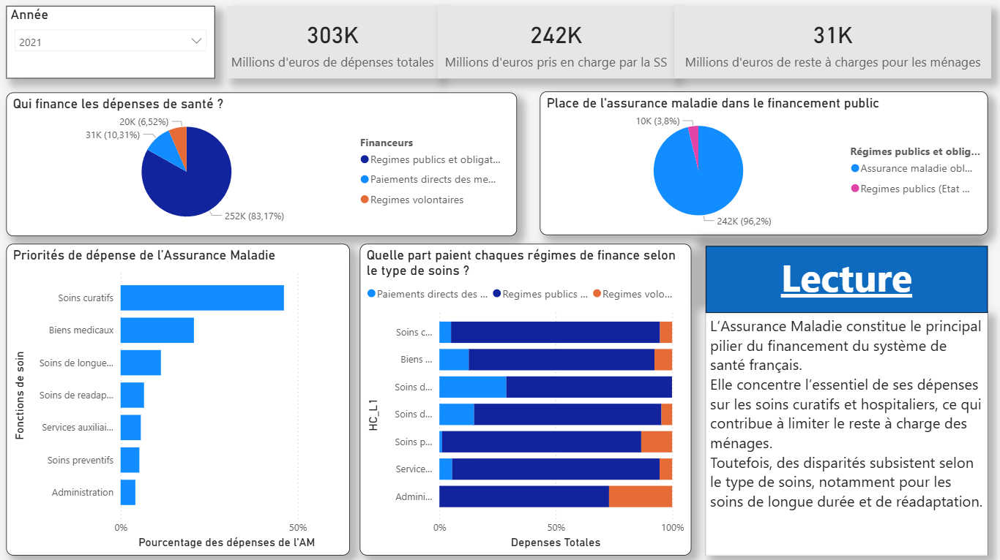

# Analyse du rôle de l’Assurance Maladie dans les dépenses de santé en France
Ce projet présente une analyse des dépenses de santé en France, en se basant sur les données de la CNS (Comptes Nationaux de la Santé). L’objectif est de visualiser et d’analyser le rôle central de l’Assurance Maladie dans le financement du système de santé français

## Compétences

###       🏥 **Santé & Analyse métier**
Décryptage du financement du système de santé français à partir de données institutionnelles (CNS – SHA), avec une approche orientée décision mettant en évidence le rôle stratégique de l’Assurance Maladie et les enjeux de reste à charge des ménages.

###       🛠️ Data Processing
Traitement, nettoyage et structuration des données avec Python (pandas), préparation des données pour la BI.

###       📊 Business Intelligence
Conception d’un tableau de bord Power BI avec KPI clairs : prise en charge, reste à charge, financeurs.

###       🎯 Data Storytelling
Lecture analytique et synthèse des résultats pour une aide à la décision claire et pédagogique.


## 📊 Données utilisées
- **Source** : data.gouv.fr – Comptabilité Nationale de la Santé (SHA) -- https://www.data.gouv.fr/datasets/les-comptes-de-la-sante-systeme-international-des-comptes-de-la-sante
- **Périmètre** : France
- **Granularité** :
  - Acteurs des soins (HP : Health care providers)
  - Financeurs des soins (HF : Health care financing schemes)
  - Fonctions de soins (HC : Health care functions)
  - Années disponibles dans le jeu de données (2021 à 2024)
   *Les acronymes et la classification des données viennent des trois axes de la SHA 2011 développée par l'OCDE, Eurostat et l'OMS.








## Structure du projet 

```
📁 Analyse_depenses_sante_France_focus_Assurance_Maladie/
│
├── 📄 README.md                  # Description du projet, objectifs, compétences, et instructions d’utilisation.
│
├── 📁 PowerBi/                   # Dossier contenant le dashboard PowerBi :
│   └── 📄 Analyse_depenses_sante_role_addurance_maladie.pbix    # Dashboard contenant une partie exploration des données pour observer les dépenses en fonction des HF, HC et HP, 
│                                                                 # et une partie synthèse pour analyser plus en détail le rôle de l'assurance maladie via l'analyse de KPI
│
├── 📁 Notebook/                  # Dossier contenant le Notebook Jupyter :
│   └── 📄 Data_Processing.ipynb    #   Filtrage des données de mapping des classification SHA et de la table de données du CNS afin de faciliter l'utilisation dans PowerBi.
│
├── 📁 original_data/               # Données originales non traitées
│   ├── 📄 cns_sha.csv              #   Données du CNS issues directement de Data.gouv
│   ├── 📄 HC_mapping.csv           # ---|
│   ├── 📄 HP_mapping.csv           #    |---> Données extraites directement de la documentation officielle de la SHA 2011 (traduites en Français)
│   └── 📄 HF_mapping.csv           #  --| 
│
├── 📁 Processed_data/              # Données traitées pour l'usage dans le PowerBi après l'utilisation du Notebook
│   ├── 📄 cns_sha.csv              
│   ├── 📄 HC_mapping.csv           
│   ├── 📄 HP_mapping.csv           
│   └── 📄 HF_mapping.csv           
|
├── 📄 Rapport_analyse.pdf        # Document PDF résumant :
│                                 #   - Les insights clés tirés des données.
│                                 #   - Les recommandations pour optimiser les dépenses de santé.
│                                 #   - Les limites de l’analyse et pistes d’amélioration.
│
├── 📁 img/                  # Dossier contenant des captures d’écran :
│   ├── 📄 pbi_exploration.png      #   - Première page du PowerBi.
│   └── 📄 pbi_synthese.png         #   - Deuxième page du PowerBi.
│
└── 📄 LICENSE
```
